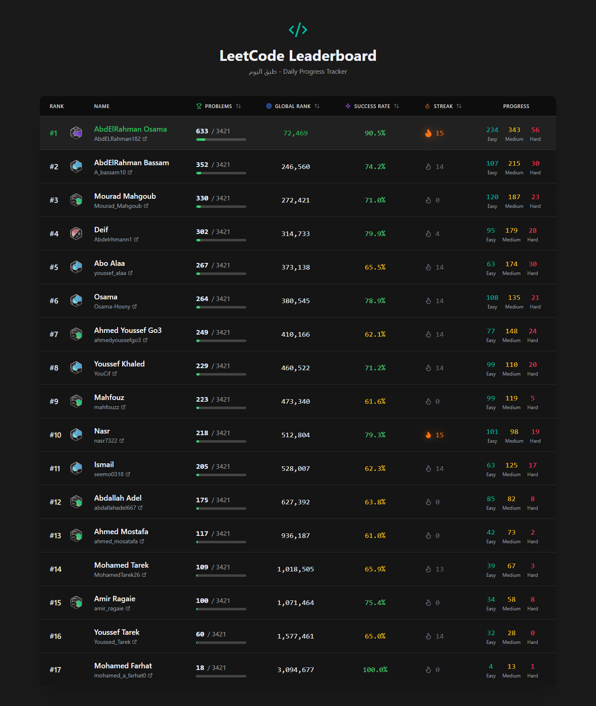

# LeetCode-LeaderBoard 

[](https://leet-code-leader-board.vercel.app/)

As a way to encourage me and my friends to solve more leetcode problems we decided to make a leaderboard website that displays users based on their LeetCode statistics. The application fetches user data from the LeetCode API and displays it in a sortable user friendly table to help keep everyone motivated and having fun.



## Features

- Display LeetCode user statistics including active badge, total problems solved, global ranking, acceptance rate, current streak, and progress in every problem difficulty.
- Sort the leaderboard by different criteria.
- Responsive design and animations with Tailwind CSS.


## Installation

1. Clone the repository:
    ```sh
    gh repo clone nasr7322/LeetCode-LeaderBoard
    ```

2. Install dependencies:
    ```sh
    npm install
    ```

3. Update users in the JSON file:
    ```sh
    src/data/users.json
    ```

4. Start the development server:
    ```sh
    npm run dev
    ```

4. Open your browser and navigate to `http://localhost:5173`.


## How It Works

For the tech stack we used Vite React for our frontend and a backend server made with Express and hosted both on Vercel.
The application uses the GraphQL LeetCode API to fetch user data from `https://leetcode.com/graphql/` by sending a query that looks something like this:

    ```
        query getUserProfile($username: String!) {
            allQuestionsCount {
                difficulty
                count
            }
            matchedUser(username: $username) {
                username
                profile {
                    realName
                    ranking
                }
                submitStats {
                    totalSubmissionNum {
                        difficulty
                        count
                        submissions
                    }
                    acSubmissionNum {
                        difficulty
                        count
                        submissions
                    }
                }
                submissionCalendar
                activeBadge {
                    displayName
                    icon
                }
            }
        }
    ```

## Host Your Own Leaderboard:

To host your own leaderboard, follow these steps:

### Hosting the Backend Server

1. **Deploy the Backend:**
   - Navigate to the `backend` directory.
   - Ensure you have a `vercel.json` file configured for the backend. This file specifies the build and routing configuration for Vercel.
   - Deploy the backend to Vercel using the Vercel CLI or the Vercel dashboard.

2. **Backend Configuration:**
   - The `backend/vercel.json` file should look like this:

     ```json
     {
         "version": 2,
         "builds": [
             {
                 "src": "./index.js",
                 "use": "@vercel/node"
             }
         ],
         "routes": [
             {
                 "src": "/(.*)",
                 "dest": "/"
             }
         ]
     }
     ```

### Hosting the Frontend Server

1. **Deploy the Frontend:**
   - Navigate to the `frontend` directory.
   - Ensure you have a `vercel.json` file configured for the frontend if needed.
   - Deploy the frontend to Vercel using the Vercel CLI or the Vercel dashboard.

2. **Frontend Configuration:**
   - The frontend is configured to use Vite for development and build. The `vite.config.ts` file is already set up for this purpose.

### Updating URLs for Self-Hosting

If you want to host your own application, you need to update the API URL in the frontend code to point to your backend server. 

1. **Update API URL in Frontend:**
   - Open the [`useLeetCode`](frontend/src/hooks/useLeetCode.ts) hook in [frontend/src/hooks/useLeetCode.ts](frontend/src/hooks/useLeetCode.ts).
   - Change the `API_URL` constant to your backend server URL:
     ```ts
     const API_URL = "https://your-backend-url.vercel.app";
     ```

2. **Deploy Changes:**
   - After making the changes, redeploy both the backend and frontend to Vercel or your preferred hosting service.

By following these steps, you can host the backend and frontend servers separately on Vercel and update the necessary URLs for self-hosting.